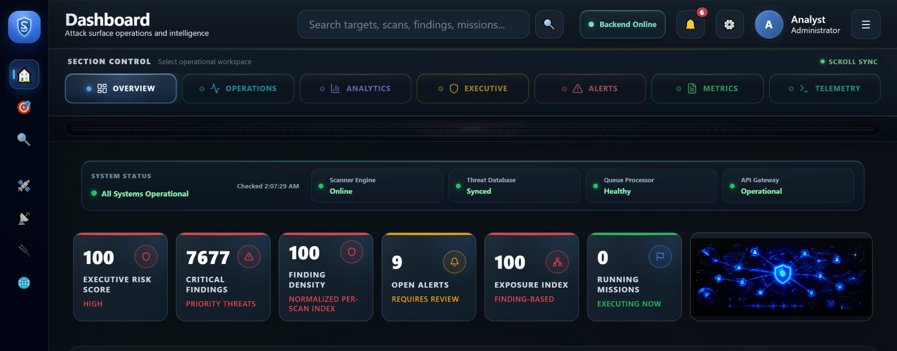
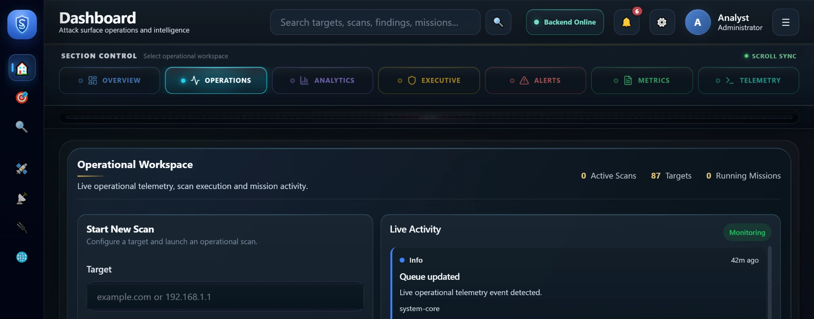
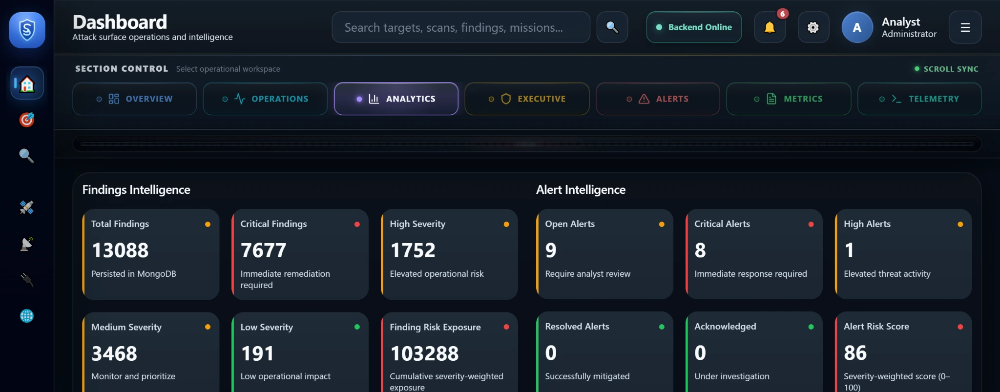
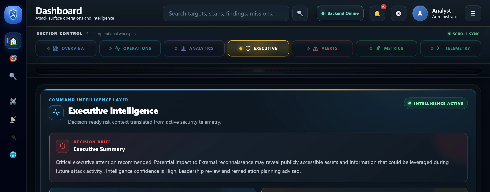
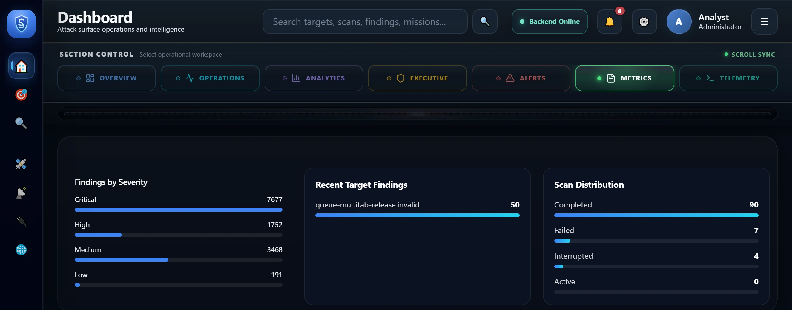
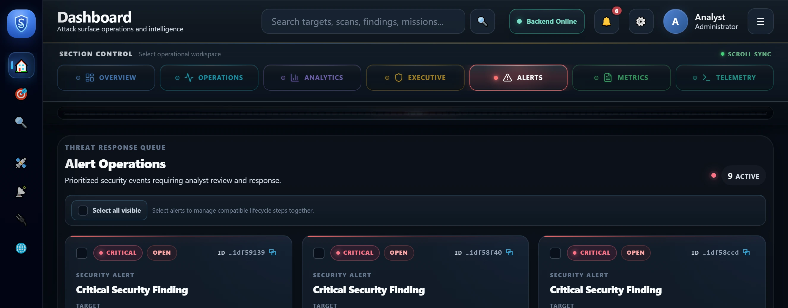
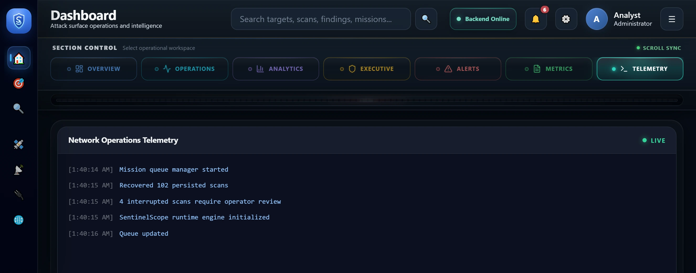

# 🛡️ SentinelScope

**Full-stack cybersecurity operations, scan orchestration, findings intelligence, alert workflows, and live telemetry.**


SentinelScope is a full-stack cybersecurity operations and intelligence platform built around a responsive SOC-style dashboard.

The project combines persistent mission and scan records, backend-authoritative queue orchestration, findings analysis, alert investigation workflows, executive intelligence, backend health monitoring, global operational search, and live telemetry.

> **Project scope:** SentinelScope is currently an advanced development and simulation platform. It is not presented as a production vulnerability scanner. The architecture is being evolved toward durable server-side workers and future real scanner integrations.

The React frontend is deployed on Vercel and communicates with a separately deployed Node.js / Express API backed by MongoDB.

## Live Deployment

| Service | Deployment |
| --- | --- |
| Frontend Application | [Open SentinelScope](https://sentinelscope-react.vercel.app) |
| Backend API | [Open API](https://sentinelscope-express.onrender.com/api) |
| Frontend Repository | [FHobbs8030/sentinelscope-react](https://github.com/FHobbs8030/sentinelscope-react) |
| Backend Repository | [FHobbs8030/sentinelscope-express](https://github.com/FHobbs8030/sentinelscope-express) |

## Current Engineering Milestone

### Server-Side Scan Queue & Multi-Tab Runtime Ownership

The current architecture moves queue authority away from individual browser tabs and into the backend while protecting mission-linked scan execution across multiple open clients.

Recently completed work includes:

- Backend-authoritative mission queue state
- FIFO mission claiming through the API
- Database-enforced single active queue lease
- Stale queue lease recovery
- Persistent scan queue recovery after refresh
- Runtime ownership leases for mission-linked scans
- Runtime owner heartbeat renewal
- Runtime lease expiration and takeover protection
- One executing browser with observer-tab synchronization
- Prevention of duplicate scan advancement across tabs
- Confirmed terminal scan persistence before runtime ownership release
- Observer synchronization from persisted backend scan state
- Automatic terminal results handling in observer tabs
- Queue drain and scanner-idle cleanup after completion

This milestone was validated with two browser tabs connected to the same mission: one tab became the runtime executor while the second remained an observer and synchronized from backend-persisted state through terminal completion.

## Dashboard Overview



The dashboard presents security operations, intelligence analysis, scan activity, findings, alert investigation, system health, reporting, and telemetry in one unified responsive workspace.

Major dashboard areas include:

- Overview
- Operations
- Analytics
- Executive Intelligence
- Alert Operations
- Metrics and system health
- Network Operations Terminal

## Platform Capabilities

### Mission Operations

SentinelScope maintains persistent mission records that organize and contextualize scan activity.

Mission capabilities include:

- Persistent mission records
- Stable client and MongoDB mission identity
- Mission lifecycle tracking
- Mission-to-scan relationships
- Backend-authoritative queue-state hydration
- FIFO queued mission recovery
- Atomic mission claiming
- Active mission reattachment after refresh
- Queue lease protection and stale lease recovery
- Mission progress and terminal-state synchronization

### Scan Operations

Mission-linked scans are coordinated through the frontend runtime while execution ownership is protected by backend runtime leases.

Scan capabilities include:

- Scan creation and persistence
- Scan status and stage tracking
- Progress telemetry
- Runtime-state persistence
- Recovery of persisted scan state
- Duplicate scan prevention
- Multi-tab runtime ownership
- Observer-tab synchronization
- Terminal persistence confirmation
- Completed, failed, cancelled, interrupted, queued, and running outcomes
- Findings generation and scan outcome metrics

## Operational Workspace



The Operational Workspace provides the primary scan and mission control surface.

Key elements include:

- Scan launch controls
- Recent scan status and pagination
- Mission queue and runtime status
- Operational summary metrics
- Findings severity visualization
- Mission and scan activity
- Runtime ownership-aware scan behavior
- Automatic results handling at terminal completion

## Findings and Alert Intelligence



SentinelScope persists findings and exposes them through server-side filtering, search, pagination, summary metrics, severity analysis, and alert relationships.

Findings capabilities include:

- Critical, high, medium, and low severity classification
- Persisted finding records
- Server-side pagination
- Server-side severity, status, target, and text filtering
- Findings summary API
- Exposure-score and severity metrics
- Finding-to-scan relationships
- Finding-to-alert relationships
- Recommended response context
- Related asset and intelligence context

Alert capabilities include:

- Persistent alert records
- Critical and high notification surfaces
- Alert severity and status tracking
- Acknowledge, investigate, resolve, and close workflows
- Selected alert details
- Related findings inspection
- Threat context enrichment
- Business impact analysis
- MITRE ATT&CK context
- Intelligence confidence scoring
- Lifecycle timeline and investigation workspace
- Alert deep links and operational focus navigation

## Executive Intelligence



Executive Intelligence converts operational records into concise security posture and decision-support information.

The workspace includes:

- Executive risk posture
- Critical exposure summaries
- Threat coverage metrics
- Active alert intelligence
- Attack surface indicators
- Mission and scan status
- Prioritized security assessment
- Recommended operational actions

## Correlation Intelligence



Correlation Intelligence connects findings, alerts, assets, severity, and operational events to provide a broader view of security activity.

The section supports:

- Related finding analysis
- Alert-to-finding relationships
- Severity correlation
- Asset exposure context
- Risk concentration analysis
- Intelligence confidence indicators
- Operational identity resolution across related records

## Alert Operations



Alert Operations provides a focused investigation workspace for reviewing active security alerts and their associated intelligence.

The workspace includes:

- Alert inventory
- Severity and status indicators
- Selected alert details
- Related findings
- Threat context
- Business impact
- Recommended actions
- Alert lifecycle management
- Investigation drawer and lifecycle timeline
- Deep-link navigation from notifications and operational search

## Network Operations Terminal



The Network Operations Terminal presents timestamped operational events, runtime updates, scan activity, mission activity, queue behavior, findings activity, recovery events, and system telemetry in a terminal-inspired interface.

## Shared Application State and Operational Navigation

SentinelScope centralizes major dashboard data so multiple workspaces can operate from consistent scan, mission, findings, and alert state.

Current frontend behavior includes:

- Shared scan state
- Shared mission state
- Shared alert state
- Shared findings state
- Global operational search
- Stable operational identity resolution
- Deep links using focused record identity
- Programmatic section navigation
- Backend recovery rehydration
- Observer-tab scan synchronization

## Backend Health and Recovery

The dashboard monitors backend availability and restores persisted API-backed state after backend recovery.

Health and recovery behavior includes:

- Backend online / offline monitoring
- API recovery events
- Data rehydration after backend availability returns
- Queue-state restoration from persisted mission records
- Scan runtime recovery from MongoDB-backed state
- Protection against duplicate scan creation during recovery

## Persistent Queue and Runtime Architecture

SentinelScope no longer relies on a browser-local queue as the authoritative mission source.

A simplified queue and execution flow is:

```text
Mission Created
    ↓
MongoDB Mission Record: queued
    ↓
Backend Queue State
    ↓
Atomic FIFO Mission Claim
    ↓
Single Active Queue Lease
    ↓
Runtime Lease Acquisition
    ↓
One Browser Becomes Runtime Owner
    ↓
Mission-Linked Scan Execution
    ↓
MongoDB Scan Persistence
    ↓
Observer Tabs Synchronize Persisted State
    ↓
Terminal Scan Persistence Confirmed
    ↓
Mission Completed / Failed / Cancelled
    ↓
Runtime + Queue Lease Cleanup
    ↓
Queue Drained / Scanner Idle
```

Runtime ownership uses a short-lived backend lease renewed by the active browser. If ownership is lost or the owner disappears, the lease can expire instead of allowing multiple browser tabs to independently advance the same mission-linked scan.

## Persistent Data Architecture

The deployed frontend communicates with the backend API to persist and retrieve operational records from MongoDB.

Persisted domain records include:

- Missions
- Scans
- Findings
- Alerts
- Queue state metadata
- Runtime ownership metadata
- Runtime state
- Intelligence metadata
- Operational activity

A simplified application data flow is:

```text
User Action
    ↓
React Dashboard
    ↓
Frontend API Services
    ↓
Node.js / Express REST API
    ↓
Mongoose Data Models
    ↓
MongoDB Persistence
    ↓
Hydrated Shared Dashboard State
```

The operational intelligence pipeline follows this general sequence:

```text
Mission
    ↓
Scan Runtime
    ↓
Findings
    ↓
Alerts
    ↓
Threat Context
    ↓
Risk and Correlation Intelligence
    ↓
Executive Intelligence
    ↓
MongoDB Persistence
    ↓
Dashboard Presentation
```

## Deployment Architecture

```text
┌──────────────────────────────────────┐
│ Vercel                               │
│ React 19.2 + Vite 8 Frontend         │
└──────────────────┬───────────────────┘
                   │ HTTPS REST requests
                   ▼
┌──────────────────────────────────────┐
│ Render                               │
│ Node.js + Express Backend API        │
│ Queue Claims + Runtime Leases        │
└──────────────────┬───────────────────┘
                   │ Mongoose
                   ▼
┌──────────────────────────────────────┐
│ MongoDB                              │
│ Missions • Scans • Findings • Alerts │
└──────────────────────────────────────┘
```

## Technology Stack

### Frontend

- React 19.2
- React DOM 19.2
- React Router 7
- Vite 8
- JavaScript ES modules
- Lucide React icons
- CSS custom properties
- Responsive grid and flexbox layouts
- Modular component architecture
- Context-based shared application state
- REST API service layer

### Backend

The production backend is maintained in the separate [`sentinelscope-express`](https://github.com/FHobbs8030/sentinelscope-express) repository.

Its primary technologies include:

- Node.js
- Express
- MongoDB
- Mongoose
- RESTful API routes
- Mission queue APIs
- Runtime lease APIs
- Persistence services
- Runtime recovery services
- Mission, scan, finding, and alert models
- CORS configuration for local and deployed clients

### Deployment

- Vercel for the React frontend
- Render for the Express backend
- MongoDB for persistent operational data
- GitHub for source control, pull requests, and milestone management

## Frontend Repository Structure

```text
sentinelscope-react/
├── client/
│   ├── public/
│   ├── src/
│   │   ├── assets/
│   │   ├── components/
│   │   ├── contexts/
│   │   ├── hooks/
│   │   ├── pages/
│   │   │   └── Dashboard/
│   │   ├── services/
│   │   │   ├── api/
│   │   │   ├── orchestration/
│   │   │   └── runtime/
│   │   ├── styles/
│   │   └── utils/
│   ├── .env.example
│   ├── package.json
│   ├── vercel.json
│   └── vite.config.js
├── docs/
│   ├── diagrams/
│   ├── reports/
│   ├── screenshots/
│   └── UI_RULES.md
├── server/
├── CHANGELOG.md
├── ROADMAP.md
└── README.md
```

The active production frontend is located in `client/`.

The production API is developed and deployed from the separate backend repository.

## Local Installation

### Prerequisites

Install the following before running the project:

- Node.js
- npm
- Git
- A running SentinelScope backend API, or access to the deployed API

### Clone the Frontend

```bash
git clone https://github.com/FHobbs8030/sentinelscope-react.git
cd sentinelscope-react/client
npm install
```

### Configure the Environment

Copy the provided example:

```bash
cp .env.example .env.local
```

For a locally running backend:

```env
VITE_API_BASE_URL=http://localhost:3001/api
```

To use the deployed backend:

```env
VITE_API_BASE_URL=https://sentinelscope-express.onrender.com/api
```

Do not commit `.env.local`.

### Start the Development Server

```bash
npm run dev
```

Vite will display the local development address in the terminal.

## Available Scripts

Run these commands from the `client` directory.

### Development

```bash
npm run dev
```

Starts the Vite development server.

### Production Build

```bash
npm run build
```

Creates an optimized production bundle in `client/dist`.

### Lint

```bash
npm run lint
```

Runs ESLint across the frontend source.

### Preview

```bash
npm run preview
```

Serves the production build locally for verification.

## Production Environment

The Vercel deployment must define:

```env
VITE_API_BASE_URL=https://sentinelscope-express.onrender.com/api
```

The frontend API configuration removes trailing slashes and builds normalized endpoint URLs from this base value.

The Vercel configuration also rewrites frontend routes to `index.html`, allowing React Router routes to load correctly when opened directly.

## Design System

SentinelScope uses a tactical SOC-inspired visual system designed around:

- Dark operational surfaces
- Semantic severity colors
- Illuminated status indicators
- Compact intelligence cards
- Responsive workspace grids
- Fixed operational controls
- High-density dashboard presentation
- Consistent spacing and typography tokens
- Desktop, tablet, and mobile layout behavior

The project-specific interface rules are documented in:

```text
docs/UI_RULES.md
```

## Recent Engineering Milestones

- Dashboard control navigation and responsive section focus
- Global search and operational identity deep links
- Shared scan, mission, findings, and alert state
- API reliability and backend recovery monitoring
- Responsive desktop, tablet, and mobile audit
- Recent scans pagination
- Findings pagination, filtering, search, and summary APIs
- Persistent mission and scan recovery
- Backend-authoritative queue-state hydration
- Backend-authoritative FIFO mission claiming
- Multi-tab runtime ownership and observer synchronization
- Confirmed terminal persistence and scanner-idle cleanup

## Validation

The current queue/runtime milestone has been validated with:

- Successful frontend ESLint validation
- Successful Vite production build
- Clean `git diff --check`
- Backend JavaScript syntax checks
- Frontend and backend production connectivity
- Persistent queue-state recovery
- FIFO mission claiming
- Two-tab runtime ownership testing
- One executor with one observer
- Observer progress synchronization
- Terminal results in both tabs
- Completed / 100% scan persistence
- Empty queue after completion
- Zero active-like scans after terminal cleanup
- Scanner animation returning to idle in both tabs

## Project Scope

SentinelScope demonstrates full-stack software engineering across:

- React component architecture
- REST API integration
- Persistent MongoDB data
- Queue orchestration
- Runtime ownership and lease semantics
- Multi-client state synchronization
- Recovery and failure-state handling
- Responsive interface engineering
- Security-oriented data modeling
- Dashboard intelligence visualization
- Cloud deployment
- Git feature-branch and pull-request workflows

The platform is designed as an extensible cybersecurity operations project. Additional scanner adapters, external intelligence feeds, authentication, authorization, multi-user services, and enterprise integrations can be added as the architecture continues to evolve.

## Roadmap

Planned areas of continued development include:

- Durable server-side scan workers
- Authentication and user accounts
- Role-based access control
- Multi-user workspaces
- Expanded scanner integrations
- External threat intelligence feeds
- Incident response workflows
- Report generation and export
- Scheduled scans and missions
- Notification services
- Administrative controls
- Additional asset correlation
- Historical intelligence trends

See [`ROADMAP.md`](ROADMAP.md) for broader project planning.

## Author

**Fred Hobbs**

- GitHub: [FHobbs8030](https://github.com/FHobbs8030)
- Frontend repository: [sentinelscope-react](https://github.com/FHobbs8030/sentinelscope-react)
- Backend repository: [sentinelscope-express](https://github.com/FHobbs8030/sentinelscope-express)

## License

This project is currently documented as licensed under the MIT License.
